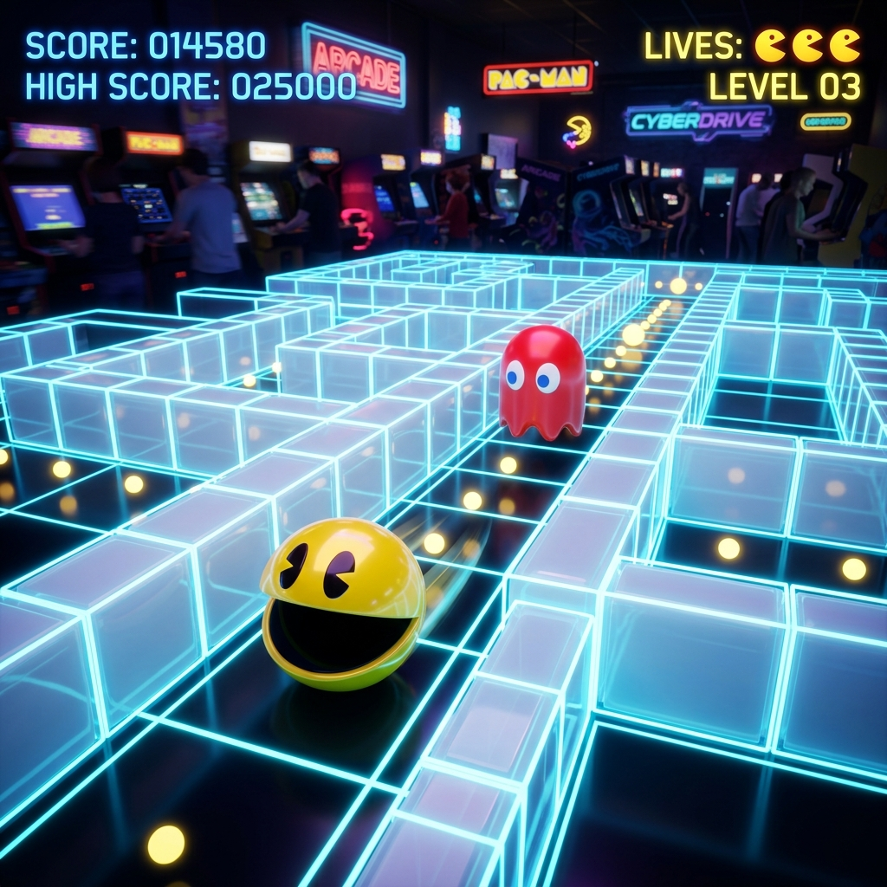

# PACMAN 3D // Cyber Arcade Web Game

A complete, production-ready, highly polished **Pacman 3D Web Game** built using modern React 19, TypeScript, TailwindCSS v4, React Three Fiber, Three.js, Framer Motion, and Zustand.

The aesthetics combine **cyberpunk neon grids** (reminiscent of Pac-Man Championship Edition), **clean geometry and materials** (inspired by Monument Valley), and **sleek glassmorphic controls** (following Apple's premium UI design).

---

## 🎮 Live Preview & Deployment

### 🔗 Play the Game: [game-pacman-3d.vercel.app](https://game-pacman-3d.vercel.app)



---

## 🚀 Key Features

- **Stylized 3D Maze World**: Built with `<instancedMesh>` for 60 FPS performance, featuring neon-glowing emissive trims, dynamic fog, and soft shadow casting.
- **Glowing Cyber Cyan Walls & Thick Outlines**: In the neon theme, walls glow with a cyber cyan emissive energy (`#00d4ff`), and their borders are highlighted in thicker, solid bright cyan (`#00FFFF`) using edges geometry to completely eliminate internal diagonal lines.
- **Reflective Ground & Grid Floor**: The neon theme floor uses Drei's `<MeshReflectorMaterial>` to display real-time reflections and shadows of Pacman, ghosts, pellets, and maze walls, overlayed with a custom purple-and-cyan grid.
- **Solid Matte Ghosts**: Ghosts are styled as solid matte colors (`roughness: 1.0`, `metalness: 0.0`) under all themes to remove shiny specular reflections while preserving their vibrant neon color glow.
- **Non-Flickering Instanced Meshes**: Fixed standard WebGL frustum-culling constraints by configuring `frustumCulled={false}` on walls and pellets, ensuring objects never vanish or flicker when panning the camera.
- **Dynamic Camera Modes**:
  - *Follow Mode*: Smooth, centered 3rd-person follow camera tracking straight behind Pacman. Includes a cinematic swooping zoom-in transition from the sky overhead when switching from top-down mode.
  - *Top-Down Mode*: Sleek isometric overhead view automatically scaled to fit your screen aspect ratio.
- **Classic Ghost AI Pathfinding**: Authentically replicates arcade AI behaviors (Blinky, Pinky, Inky, Clyde) across *Chase*, *Scatter*, *Frightened*, and *Respawn* modes.
- **Waving Ghost Skirt (Feet)**: Ghosts feature animated bottom tentacles wiggling in phase-shifted sine waves, keeping their colors perfectly synchronized with their state.
- **Procedural Web Audio Synthesizer**: Generates chiptunes (start melodies, munching wakas, death drops, victory fanfares) procedurally in the browser, eliminating external audio assets or load failures.
- **Animated 3D Pacman**: Features a buttery-smooth waka-waka mouth chewing animation with slowed majestical cycles (speed `11`) and smooth lerp transitions when starting and stopping.
- **UI-Only Zen mode (Fullscreen)**: Toggles top HUD header and sidebar panels to expand the canvas to full screen inside the browser window using React state.
- **Premium Glassmorphic UI**: 30px rounded corners, backdrop-blur HUDs, statistics dashboard, daily challenges, and unlocked achievements tracking.
- **Mobile First**: Built-in touch controllers featuring an on-screen swipe/drag virtual joystick.
- **SEO & PWA optimized**: Implements `react-helmet-async` header injection, schema.org VideoGame structured data, manifest settings, and Vercel caching rules.

---

## 🛠️ Tech Stack

- **Framework**: React 19 (Vite)
- **Language**: TypeScript (Strict mode)
- **3D Graphics**: Three.js & React Three Fiber (R3F)
- **State Management**: Zustand
- **Animations**: Framer Motion
- **Styling**: TailwindCSS v4
- **SEO & Meta**: React Helmet Async
- **Visuals/Particles**: HTML Canvas & WebGL GPU Instancing

---

## 📁 Project Structure

```
src/
├── types/          # Strict TypeScript declarations (entities, directions, achievements)
├── store/          # Zustand store coordinating state logic & physics simulation
├── components/     # UI, layouts, and 3D scenes
│   ├── game/       # 3D actors: Pacman, Ghosts, Maze walls, Pellets instanced, Particles
│   ├── layout/     # Glassmorphic top HUD and stats Sidebar
│   └── ui/         # Buttons, Cards, Modals, and Joystick
├── utils/          # Core algorithms (Ghost pathfinding, Maze grid logic, Web Audio Synth)
├── seo/            # Helmet component for page metadata
├── services/       # Local database simulators (Leaderboard, challenges)
├── hooks/          # Controls & events hooks
├── pages/          # Spa pages (MenuPage, GamePage)
└── index.css       # TailwindCSS v4 imports, global typography, and keyframe animations
```

---

## 🔧 Installation & Local Setup

1. **Clone the repository** (or navigate to the project directory)
2. **Install dependencies**:
   ```bash
   npm install --legacy-peer-deps
   ```
3. **Run the development server**:
   ```bash
   npm run dev
   ```
4. **Build the production bundle**:
   ```bash
   npm run build
   ```
5. **Preview the build locally**:
   ```bash
   npm run preview
   ```

---

## 🎮 Gameplay Controls

### Desktop (PC)
- **Steer Pacman**: `W`/`A`/`S`/`D` or `Arrow Keys` (Up, Down, Left, Right)
- **Pause/Resume**: `Spacebar`

### Mobile / Tablet
- **Steer Pacman**: Drag/Swipe the **Virtual Joystick** overlay at the bottom center.
- **Settings/Pause**: Tap the floating buttons or HUD panel triggers.

---

## 📡 Deployment to Vercel

The project is fully configured for Vercel out of the box using `vercel.json` for URL redirection and caching policies.

### Deploying via Vercel CLI
```bash
# Install Vercel CLI if not already installed
npm install -g vercel

# Trigger deployment
vercel
```

### Deploying via Vercel Web Dashboard
1. Connect your GitHub repository to Vercel.
2. Select **Vite** as the framework template.
3. The build command `npm run build` and output directory `dist` are automatically configured.
4. Click **Deploy**.
